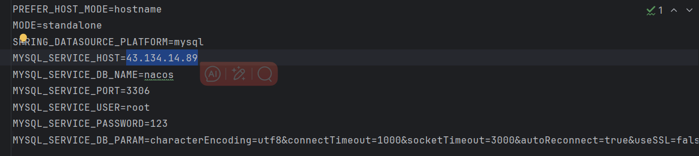
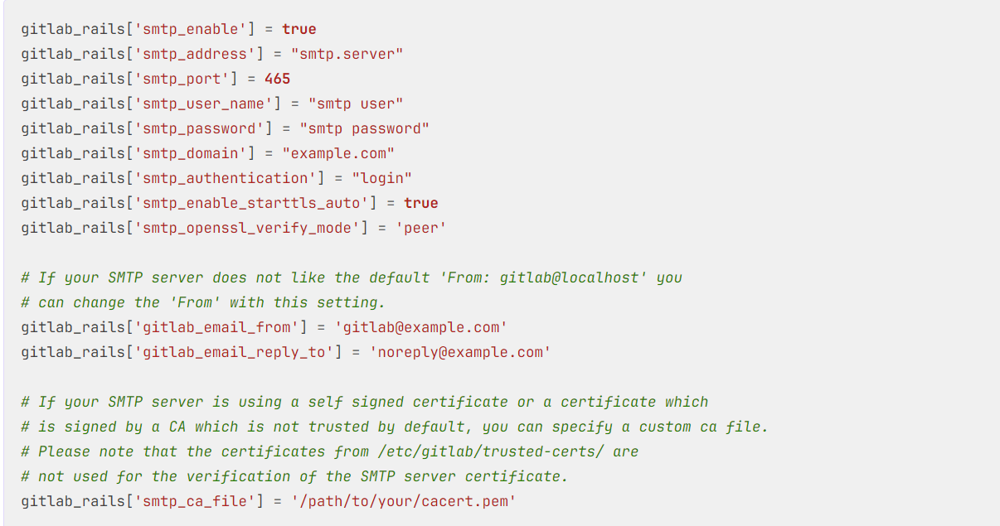
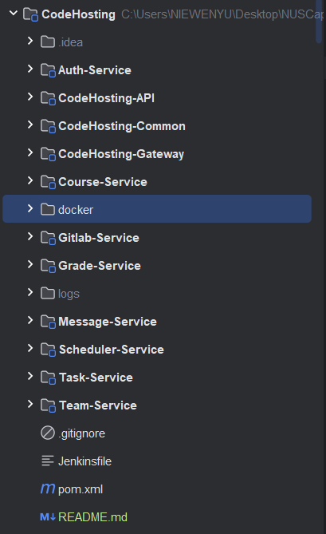
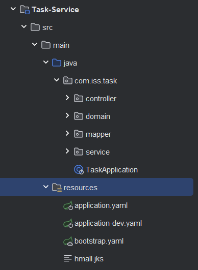
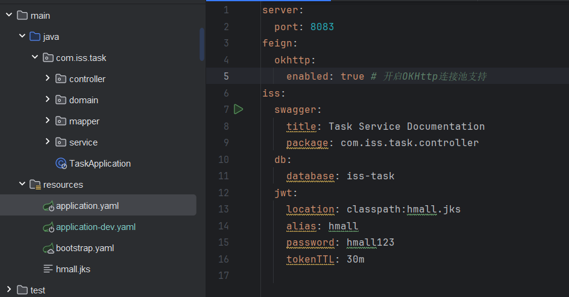
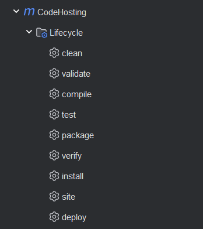
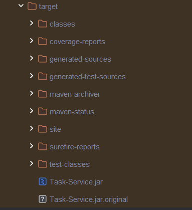
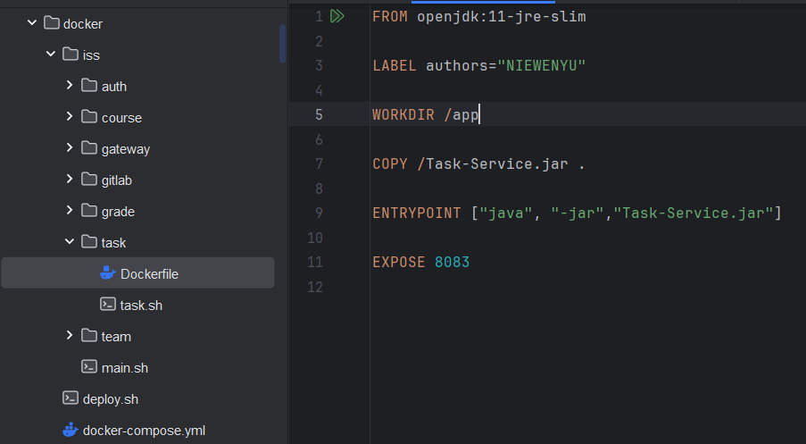
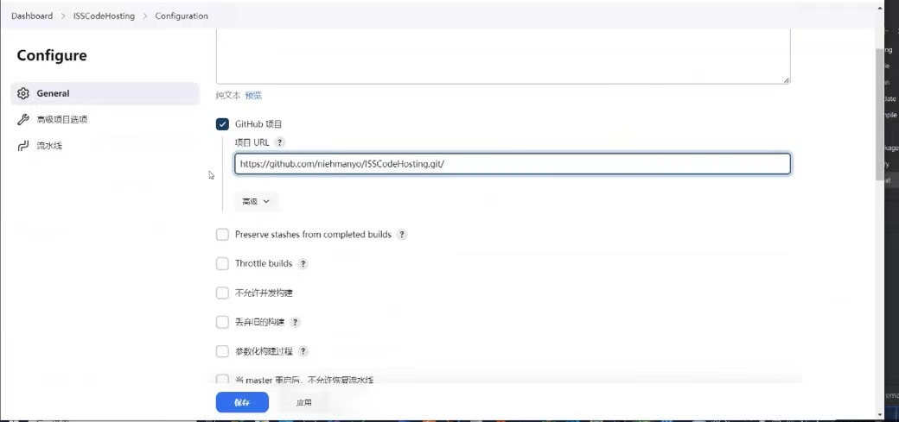
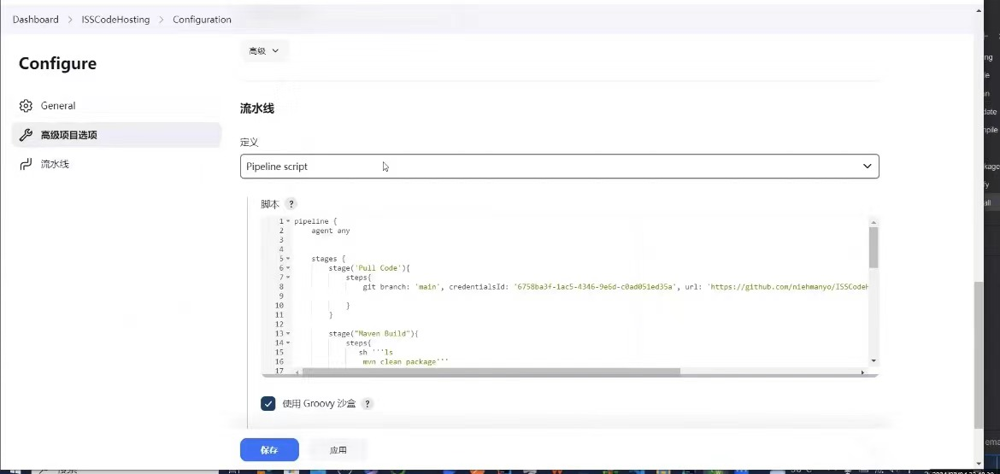

# Deployment

* [Mysql](#mysql)
* [Nacos](#nacos)
* [Redis](#redis)
* [Gitlab](#gitlab)
* [NUS-ISS Project Deployment](#nus-iss-project-deployment)

## Mysql
Pull mysql docker 
```shell
docker pull mysql:latest
```
Before start mysql, you need to create volume so that the data wont be lost.
```shell
docker volume create mysql_volume
docker inspect mysql_volume ##check the path in your server
```
Start mysql container
```shell
docker run --name mysql \ 
-v /path/your_data_volume:/var/lib/mysql \
-p 3306:3306 \
-d mysql
```
## Nacos
Before start nacos, you should run [_nacos.mysql_](nacos.sql) to create a database which store all data of nacos
Change the HOST to your server's ip
```shell
docker pull nacos
```
Then you need to copy [_custom.env_](custom.env) to your server.(You can choose 'ubuntu' path or other path)



Start nacos
```shell
docker run -d \
--name nacos \
--env-file /your-path/custom.env \
-p 8848:8848 \
-p 9848:9848 \
-p 9849:9849 \
--restart=always \
nacos/nacos-server:v2.1.0-slim
```

## Redis
Pull redis docker
```shell
docker pull redis:latest
```
Before start mysql, you need to create volume so that the data wont be lost.
```shell
docker volume create reids_volume
docker inspect redis_volume ##check the path in your server
```
Start redis
```shell
docker run --name redis -p 6379:6379 -v /path/your_data_volume:/data -d redis
```
## Gitlab
Pull gitlab docker
```shell
docker pull gitlab/gitlab-ce
```

```shell
sudo docker run --detach \
  --hostname gitlab.example.com \
  --env GITLAB_OMNIBUS_CONFIG="external_url 'http://gitlab.example.com'" \
  --publish 443:443 --publish 80:80 --publish 22:22 \
  --name gitlab \
  --restart always \
```

How to set STMP configuration in Gitlab(Once the you set the email, then gitlab will sent notification by the email.
**!!!This configuration must be set, otherwise, 
gitlab will not send emails to notify students 
when they register an account on the Platform** )
https://docs.gitlab.com/omnibus/settings/smtp.html


**SEE MORE ABOUT GITLAB** https://docs.gitlab.com/ee/install/docker/

## NUS-ISS Project Deployment
CodeHosting is a springboot project, the structure is following: 


What we need to do is to deploy these services inside docker


Check the application-dev.yaml, you need to change the ip


You need to use "mvn package", which is package in this picture. This is to package each service to jar file.


You need to use jar to create docker images with Dockerfile.


I put the jar package of all the services into the corresponding folder, which has the Dockerfile of each service, and create the docker container of each service with shell script

This is an example of creating Task-Service docker container.
```dockerfile
FROM openjdk:11-jre-slim

LABEL authors="NIEWENYU"

WORKDIR /app

COPY /Task-Service.jar .

ENTRYPOINT ["java", "-jar","Task-Service.jar"]

EXPOSE 8083

```


This is the docker-compose
```dockerfile
version: '2.2'

services:
  auth:
    image: auth:latest
    ports:
      - 8081:8081

  gateway:
    image: gateway:latest
    ports:
      - 8088:8088


  gitlab:
    image: gitlab:latest
    ports:
      - 8082:8082


  task:
    image: task:latest
    ports:
      - 8083:8083


  team:
    image: team:latest
    ports:
      - 8086:8086


  course:
    image: course:latest
    ports:
      - 8085:8085

  grade:
    image: grade:latest
    ports:
      - 8084:8084

```
In Jenkins. Firstly create a pipeline item. Then link the github and write the pipeline script





This is the pipeline script on Jenkins
```groovy
pipeline{
    agent any
    
    stages{
        stage("Pull code"){
            steps{
                git branch: 'your-branch',
                credentialsId: 'The credential linked to github ',
                url: 'github url'
            }
        }
        stage(Maven Build){
            steps{
                sh '''mvn clean package'''
            }
        }

        stage(JUnit Test){
            steps{
                sh '''mvn test'''
            }
        }

        stage(Jacoco){
            steps{
                jacoco classPattern: 'your-service/target/classes', execPattern: 'your-service/target/coverage-reports/**.exec',runAlways: true
            }
        }
        
        stage(Docker Deploy){
            steps{
                sh '''
                    cd docker 
                    chmod 777 deploy.sh
                    ./deploy.sh'''
            }
        }
    }
}
```

